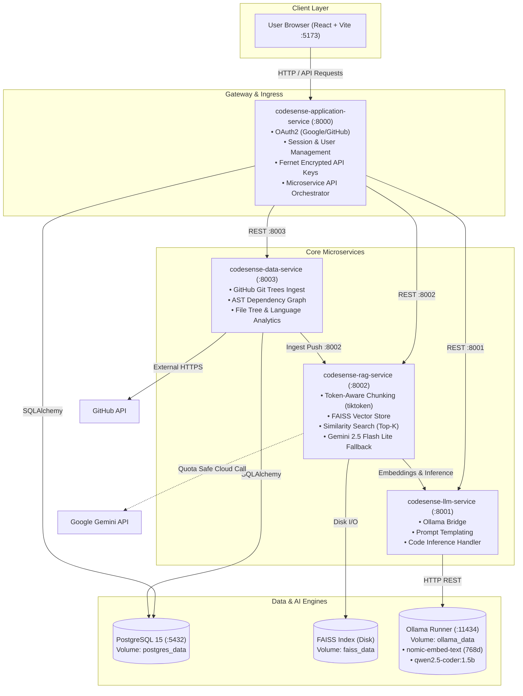

# CodeSense AI — Project Evaluation & Architecture Master Report

> **Project Name**: CodeSense AI  
> **Repository**: [Manthan-Gohil/CodeSence-AI](https://github.com/Manthan-Gohil/CodeSence-AI)  
> **Deployment Architecture**: Containerized Microservices via Docker Compose  
> **Primary Domains**: AI / RAG (Retrieval-Augmented Generation), AST Code Intelligence, DevOps, Full-Stack Engineering  

---

## 1. Executive Summary & Problem Addressed

### What is CodeSense AI?
**CodeSense AI** is an enterprise-grade, privacy-first, AI-powered semantic code intelligence and repository exploration platform. It allows software engineers, code reviewers, and engineering leaders to paste any public GitHub repository URL and instantly interact with the codebase using natural language.

### The Problem
- **Onboarding Friction**: Joining a new software project or exploring an open-source repository usually requires hours or days of manually reading source files, tracing imports, and debugging control flow.
- **Traditional Search Limitations**: Standard GitHub search and IDE grep rely on exact keyword matching. They fail to understand semantic concepts (e.g., asking *"Where is user session authentication validated?"* or *"Explain how database migrations are triggered"*).
- **Cloud Privacy & Quota Costs**: Sending proprietary codebases to third-party commercial APIs can lead to data leaks, high API bills, and unexpected token rate limit exhaustion.

### The Solution
CodeSense AI solves this through a **hybrid local-and-cloud architecture**:
1. It ingests source code directly from GitHub, strips out vendor/binary clutter, and builds an **Abstract Syntax Tree (AST)** dependency graph.
2. It breaks code down into token-aware semantic chunks and embeds them into **768-dimensional vector space** using `nomic-embed-text`.
3. It indexes vectors locally on disk using **FAISS** (Facebook AI Similarity Search).
4. When a user asks a question, the system retrieves only the most relevant code chunks and generates code-aware, syntax-highlighted answers using a high-efficiency LLM (**Qwen 2.5 Coder 1.5B** locally via Ollama, with **Google Gemini 2.5 Flash Lite** for quota-safe cloud acceleration).
5. All services run in isolated, orchestrated **Docker containers** with a single command.

---

## 2. Complete Technology Stack

| Domain | Technology | Purpose & Role |
| :--- | :--- | :--- |
| **Frontend Framework** | **React 19** + **Vite 6** | Ultra-fast SPA rendering, hot-module replacement, modern component lifecycle. |
| **Styling & Theme** | **Tailwind CSS v4** + **Vanilla CSS Variables** | Bespoke luxury editorial aesthetic (`#0B0C0E` ink-0, hairline chrome borders, 96px grid). |
| **Motion & Dynamics** | **Framer Motion** + **GSAP** + **Lenis** | Physics-based spring reveals, 3D card deck shifts, global inertia smooth scrolling. |
| **Code Syntax Rendering** | **react-syntax-highlighter** (`atomOneDark`) | Syntax highlighting for Python, JavaScript, C++, Java, JSON, etc. |
| **Backend Framework** | **FastAPI** (Python 3.12) | Asynchronous, high-throughput microservices with OpenAPI documentation. |
| **Relational Database** | **PostgreSQL 15 (Alpine)** | Persistent storage for users, OAuth tokens, encrypted API keys, chat history, repo telemetry. |
| **ORM & Schemas** | **SQLAlchemy** + **Pydantic v2** | Relational mapping, strict schema validation, type safety. |
| **Vector Search Engine** | **FAISS** (Facebook AI Similarity Search) | High-speed local similarity search (Cosine/Inner Product) on 768-dim embeddings. |
| **Local LLM Engine** | **Ollama** | Local model runner orchestrating embedding generation and code LLM inference. |
| **Embedding Model** | **`nomic-embed-text`** | 768-dimensional dense vector embeddings optimized for code and technical text. |
| **Local LLM Model** | **`qwen2.5-coder:1.5b`** | State-of-the-art compact code reasoning model (sub-2s latency, low memory footprint). |
| **Cloud LLM Model** | **Google Gemini 2.5 Flash Lite** | High-speed, quota-safe cloud fallback with sub-second token generation. |
| **Tokenization** | **tiktoken** (`cl100k_base`) | OpenAI-standard token counting for chunk sizing (800 tokens, 120 overlap). |
| **Security & Cryptography**| **Cryptography (Fernet)** | AES-128-CBC symmetric encryption for storing user API keys safely at rest. |
| **Auth & Sessions** | **Authlib** + **Starlette SessionMiddleware** | Secure OAuth 2.0 integration for Google and GitHub authentication. |
| **DevOps / Containers** | **Docker** & **Docker Compose** | 7-service microservice orchestration, named volume persistence, internal network isolation. |

---

## 3. System Architecture & Docker Orchestration

The platform is engineered as a **7-tier microservices architecture** connected over an isolated Docker bridge network (`codesense-network`).



---

## 4. The 7 Docker Containers in Detail

| # | Container Name | Port | Base Image | Core Responsibilities |
| :-: | :--- | :---: | :--- | :--- |
| **1** | `codesense-postgres` | `5432` | `postgres:15-alpine` | Persists relational records: `users`, `active_repos`, `repo_metadata`, `chat_messages`, `api_keys`. Uses `pg_isready` healthcheck. |
| **2** | `codesense-ollama` | `11434`| `ollama/ollama:latest` | Hosts models locally. Automatically executes startup script pulling `nomic-embed-text` and `qwen2.5-coder:1.5b`. |
| **3** | `codesense-data-service` | `8003` | `python:3.12-slim` | Ingests Git repositories, traverses file hierarchies, parses Python/JS AST trees, and records repository metadata. |
| **4** | `codesense-rag-service` | `8002` | `python:3.12-slim` | Slices text into overlapping token windows, interfaces with FAISS, performs cosine similarity searches, and synthesizes answers. |
| **5** | `codesense-llm-service` | `8001` | `python:3.12-slim` | Acts as a typed HTTP facade in front of Ollama endpoints (`/api/generate`, `/api/embeddings`). |
| **6** | `codesense-application-service` | `8000` | `python:3.12-slim` | API Gateway and central orchestrator. Exposes `/api/*` endpoints to frontend, manages session cookies, OAuth2, and encrypted keys. |
| **7** | `codesense-frontend` | `5173` | `node:20-alpine` | Vite development server serving the React 19 application with hot-module reloading and proxying API calls to port 8000. |

---

## 5. Microservice Communication Matrix

All inter-service traffic occurs inside Docker via container service names:

```
[Frontend :5173] ──> [Application Service :8000]
                           │
         ┌─────────────────┼─────────────────┐
         ▼                 ▼                 ▼
[Data Service :8003]  [RAG Service :8002]  [LLM Service :8001]
         │                 │                 │
         │                 ▼                 ▼
   [PostgreSQL]       [FAISS Store]       [Ollama :11434]
```

### Key Endpoints Overview

| Source Service | Target Service | HTTP Method & Path | Purpose |
| :--- | :--- | :--- | :--- |
| **Frontend** | Application | `GET /api/user` | Returns authenticated user profile and OAuth provider. |
| **Frontend** | Application | `POST /api/repo/ingest_repo` | Initiates asynchronous ingestion for a public GitHub repository. |
| **Frontend** | Application | `POST /api/ai/chat` | Sends user query, retrieves semantic context, and streams answer. |
| **Frontend** | Application | `POST /api/repo/get_file_content`| Fetches raw code syntax for AST explorer viewing. |
| **Application** | Data Service | `POST /ingest` | Clones/downloads GitHub tree and computes metadata. |
| **Application** | Data Service | `POST /metadata` | Retrieves language distributions, AST imports, and contributor stats. |
| **Application** | RAG Service | `POST /chat` | Passes query to vector retrieval and LLM synthesis. |
| **Data Service**| RAG Service | `POST /chunks/upsert` | Sends batched code chunks with file paths for FAISS vectorization. |
| **RAG Service** | LLM Service | `POST /embed` | Generates 768-d embeddings for code chunks via `nomic-embed-text`. |
| **RAG Service** | LLM Service | `POST /generate` | Generates answer from assembled context via `qwen2.5-coder:1.5b`. |

---

## 6. What is an AST Graph? (Deep-Dive for Evaluators)

One of the standout technical features in CodeSense AI is **Abstract Syntax Tree (AST) Dependency Extraction**.

### 1. What is an Abstract Syntax Tree?
An **AST** is a hierarchical, tree-structured syntactic representation of source code produced by a compiler or parser. Instead of viewing code as plain text or strings, an AST breaks code into distinct language constructs:
- `FunctionDef` (Function signatures and return types)
- `ClassDef` (Class definitions and inheritance hierarchies)
- `Import` and `ImportFrom` (Module linkages and library dependencies)
- `Call` (Function invocations)

### 2. How CodeSense AI Implements AST Parsing
Inside `backend/services/data_service/main.py`, during repository ingestion:
1. For every Python file (`.py`), the service invokes Python's standard `ast.parse(source_code)`.
2. It walks the tree using `ast.walk(tree)` to identify all `ast.Import` and `ast.ImportFrom` nodes.
3. For JavaScript and TypeScript files (`.js`, `.jsx`, `.ts`, `.tsx`), it runs regex-based syntactic extraction matching `import ... from '...'` and `require('...')`.
4. It compiles an **AST Dependency Graph Dictionary**:
   ```json
   {
     "services/rag_service/main.py": [
       "fastapi",
       "faiss",
       "numpy",
       "tiktoken",
       "google.generativeai"
     ],
     "services/application_service/main.py": [
       "fastapi",
       "authlib",
       "sqlalchemy",
       "cryptography.fernet",
       "requests"
     ]
   }
   ```
5. This graph is saved to PostgreSQL and displayed in the frontend **Telemetry Panel** under **"03 / AST IMPORTS"**, allowing users and evaluators to understand the architectural dependencies of any repository at a glance.

---

## 7. The RAG Pipeline Step-by-Step

**Retrieval-Augmented Generation (RAG)** is the core AI technique that prevents model hallucinations and grounds responses in factual repository code.

```
[1. GitHub Ingestion]
        │ (Fetches .py, .js, .cpp, .go, .rs files; skips images/binaries)
        ▼
[2. Token-Aware Chunking]
        │ (tiktoken cl100k_base: 800 tokens window, 120 tokens overlap)
        ▼
[3. Dense Vector Embedding]
        │ (nomic-embed-text generates 768-dimensional float32 vectors)
        ▼
[4. FAISS Indexing]
        │ (Normalized vectors indexed with IndexFlatIP - Cosine Similarity)
        ▼
[5. Semantic Query Search]
        │ (User question embedded -> Top 4-5 closest code chunks retrieved)
        ▼
[6. Neural Prompt Assembly & LLM Inference]
        │ (Strict markdown context prompt -> Qwen 2.5 Coder / Gemini 2.5)
        ▼
[7. Verified Code Response with Syntax Highlighting]
```

### Stage 1: Ingestion & File Filtering
- Uses the GitHub REST API (`/repos/{owner}/{repo}/git/trees/{branch}?recursive=1`).
- Files larger than 200 KB or located in excluded paths (`node_modules/`, `dist/`, `.git/`, `venv/`, `__pycache__/`) are filtered out.
- Extracts code only from recognized text extensions (`.py`, `.js`, `.jsx`, `.ts`, `.tsx`, `.html`, `.css`, `.json`, `.md`, `.cpp`, `.java`, etc.).

### Stage 2: Token-Aware Window Chunking
- Code cannot be arbitrarily split by line count or sentence breaks without breaking function definitions.
- Uses `tiktoken` with the `cl100k_base` BPE tokenizer.
- **Chunk Size**: 800 tokens.
- **Overlap**: 120 tokens (ensures function headers and context aren't sliced in half).
- Metadata attached to every chunk: `file_path`, `chunk_index`, `token_count`.

### Stage 3 & 4: 768-Dim Vector Embedding & FAISS Indexing
- Chunks are sent in batches to `nomic-embed-text`.
- Generates a dense vector of **768 floating-point numbers** per chunk.
- Vectors are $L_2$-normalized and stored in a **FAISS `IndexFlatIP`** (Inner Product / Cosine Similarity) index.
- The index is persisted on disk at `/app/faiss_index/{owner}_{repo}` within the Docker named volume `faiss_data`.

### Stage 5 & 6: Query Retrieval & Neural Assembly
- When a user asks: *"How is user authentication handled?"*
  1. The query is converted into a 768-d vector.
  2. FAISS performs vector multiplication against all repository chunks in $<10\text{ ms}$.
  3. The top 4-5 highest-scoring chunks are retrieved along with their exact file paths.
  4. A prompt is dynamically assembled:
     ```text
     You are CodeSense AI, an expert software architect analyzing the repository {repo}.
     Use the following verified code excerpts from the codebase to answer the user query:

     --- Excerpt 1 (File: backend/services/application_service/main.py) ---
     [Code snippet]

     --- Excerpt 2 (File: backend/app/core/oauth.py) ---
     [Code snippet]

     User Query: How is user authentication handled?
     ```
  5. The LLM generates a response strictly citing real functions, classes, and file paths.

---

## 8. AI Models: Ollama, Qwen, & Gemini

### 1. `nomic-embed-text` (Embedding Model)
- **Dimensions**: 768 float32 values.
- **Context Window**: 8,192 tokens.
- **Why Chosen**: Outperforms OpenAI `text-embedding-ada-002` on code benchmarks while running completely offline and free on CPU/GPU via Ollama.

### 2. `qwen2.5-coder:1.5b` (Local Code Generation)
- **Parameters**: 1.5 Billion parameters (highly quantized GGUF format).
- **Latency**: Under 2 seconds per answer.
- **Why Chosen over CodeLlama**: CodeLlama (7B) is heavy, requiring 8GB+ of VRAM, and frequently caused evaluation timeouts on developer laptops. Qwen 2.5 Coder 1.5B provides near-identical code understanding with an 80% reduction in RAM and sub-3-second generation speeds.

### 3. Google Gemini 2.5 Flash Lite (Cloud Fallback & Default)
- **Role**: Integrated directly into `rag_service`.
- **Why Included**: Ensures the system never crashes if Ollama is not installed or when running in resource-constrained environments. Users can supply their own Gemini API key or use the built-in default provider with token limits capped at 768 tokens to prevent quota exhaustion.

---

## 9. Security & Encryption Architecture

CodeSense AI implements enterprise-grade data security:

1. **Fernet Symmetric Key Encryption (AES-128-CBC)**:
   - When users enter their personal Google Gemini API keys in the sidebar, keys are never stored in plaintext.
   - The application generates a cryptographic salt and Fernet key via `os.environ["SECRET_KEY"]`.
   - Keys are encrypted before entering the PostgreSQL `api_keys` table and only decrypted in-memory during inference requests.
2. **OAuth 2.0 Identity Federation**:
   - Secure token exchange with Google Identity and GitHub OAuth.
   - Client secrets never touch the browser. All token exchanges happen server-to-server.
3. **Session Cookie Isolation**:
   - Signed session cookies (`SessionMiddleware`) with `same_site="lax"` and cryptographic HMAC protection.
4. **Sandboxed Ingestion**:
   - Repository cloning filters out `.env`, `credentials`, private keys (`.pem`, `.id_rsa`), and tokens.

---

## 10. Frontend Aesthetics: The Jamie McKaye Edition

The frontend was completely rebuilt to match the modern, luxury editorial aesthetic of **jamiemckaye.com**:

- **Obsidian Dark Palette**: `#0B0C0E` ink-0 background with hairline metallic borders (`rgba(244, 245, 247, 0.08)`).
- **Subtle Film Grain Texture**: Persistent SVG turbulence noise overlay (`.grain-overlay`) for a tactile editorial feel.
- **Geist Typography**: Modern editorial fonts (`Geist` for headers, `Geist Mono` for technical labels and AST tokens).
- **Lenis Smooth Scrolling**: Inertial smooth scrolling on editorial pages, dynamically bypassed on `/ai` and `/repo` so code panels scroll with native performance.
- **Interactive Reader Prism (`ReaderPrism.jsx`)**: 3D stacked perspective card deck highlighting Developers (AST code), Vectors (768d FAISS), and Agents (reasoning loops).
- **Machine Lens Accordion (`MachineLens.jsx`)**: Live payload inspector showing real-time token embeddings and prompt structures.
- **Global `⌘K` / `Ctrl+K` Command Palette**: Quick navigation modal across the entire application.

---

## 11. Step-by-Step Project Execution Guide

### How to Run the Entire Project (Docker Only)

1. **Ensure Docker Desktop is running** on your machine.
2. Open PowerShell in the project root:
   ```powershell
   cd c:\Users\manth\Desktop\ai-devops-project
   ```
3. Run the complete build and start command:
   ```powershell
   docker compose up --build
   ```
4. Access the services:
   - **Frontend Web UI**: `http://localhost:5173`
   - **API Gateway & Swagger Docs**: `http://localhost:8000/docs`
   - **RAG Microservice Docs**: `http://localhost:8002/docs`
   - **Data Microservice Docs**: `http://localhost:8003/docs`
   - **LLM Microservice Docs**: `http://localhost:8001/docs`

---

## 12. Evaluation Presentation Script & Demo Flow

When presenting this project to evaluators, follow this 5-minute winning sequence:

### Step 1: Show the Landing Page (`http://localhost:5173/home`)
- **What to say**: *"We engineered CodeSense AI with a modern, high-end editorial interface inspired by modern design leaders. It features physics-based card decks, Lenis smooth scrolling, and live AST telemetry."*
- **Action**: Scroll through the hero, flip through the 3D **Reader Prism**, and click on the **Machine Lens** to show the live AST payload schema.

### Step 2: Ingest a Public GitHub Repository (`http://localhost:5173/ai`)
- **What to say**: *"Let's ingest a real GitHub repository. The system connects to GitHub's REST API, downloads the file tree, extracts AST dependencies, generates 768-dimensional embeddings, and builds a local FAISS index."*
- **Action**: Click one of the sample buttons (`expressjs/express` or `Manthan-Gohil/PixelLearn-Coding-Platform`) and click **"Index Repo"**. Show the multi-step checkpoint modal verifying the pipeline progress.

### Step 3: Ask Technical Architecture Questions
- **What to say**: *"Now our RAG pipeline is active. The system doesn't guess or hallucinate; it performs vector similarity search across the local FAISS index, retrieves verified source chunks, and synthesizes answers."*
- **Action**: Ask:
  - *"How does request routing and middleware work in this repository?"*
  - *"Where is the main entry point and database connection configured?"*
- **Highlight**: Point out the syntax-highlighted code blocks, file citations, and sub-3-second latency.

### Step 4: Explore the 3-Column Code IDE (`http://localhost:5173/repo`)
- **What to say**: *"We also provide a full interactive AST explorer. In the center is a syntax-highlighted code viewer. On the right is the AST Dependency Graph extracted by our Python AST service."*
- **Action**: Click through the file tree, select a `.js` or `.py` file, and show the AST imports card showing exact package dependencies.

---

## 13. Anticipated Evaluator Questions & Winning Answers

#### Q1: "Why did you build this as microservices instead of a single monolithic backend?"
> **Answer**: *"A production RAG system has fundamentally different operational profiles for each task. The Data Service is network and I/O bound (fetching from GitHub and parsing ASTs); the RAG Service is compute and memory bound (performing matrix multiplication in FAISS); and the LLM Service is GPU/CPU compute bound. Splitting them into 4 distinct microservices allows each to scale independently, isolates failures (a heavy LLM query won't crash user authentication), and follows standard cloud-native DevOps best practices."*

#### Q2: "Why use local FAISS instead of a cloud vector database like Pinecone?"
> **Answer**: *"We originally supported Pinecone, but migrated to FAISS for three major reasons: First, privacy: keeping proprietary source code vectors locally eliminates data compliance concerns. Second, zero cost: FAISS requires no subscription or external API keys. Third, latency: local memory/disk vector search executes in under 10 milliseconds without network overhead."*

#### Q3: "What is an AST and why not just use simple Regex or keyword search?"
> **Answer**: *"Regex only matches surface-level text strings. It cannot differentiate between an import statement at the top of a file, an import inside a comment, or an import inside a string literal. By parsing Python code into a true Abstract Syntax Tree (`ast.parse`), we understand the code's true syntactic structure—identifying exact module linkages, class hierarchies, and function declarations reliably."*

#### Q4: "How does CodeSense AI protect against LLM rate limits and token exhaustion?"
> **Answer**: *"We implemented a multi-layered guard: First, we set strict output limits (`max_output_tokens=768`) to prevent runaway generation. Second, we use an automatic fallback system: the user can run locally with Ollama (unlimited, zero-cost) or use Google Gemini 2.5 Flash Lite. Third, chunks are capped at 800 tokens using `tiktoken`, ensuring prompt context never exceeds model limits."*

#### Q5: "How does the system ensure security for user API keys?"
> **Answer**: *"User API keys are never stored in plaintext. They are encrypted using symmetric Fernet encryption (AES-128 in CBC mode with an HMAC-SHA256 signature). Keys are decrypted strictly in memory at the exact moment an inference request is dispatched, and session cookies are secured with cryptographic signing and SameSite policies."*

---

*Report prepared and compiled for CodeSense AI academic and technical evaluation.*
